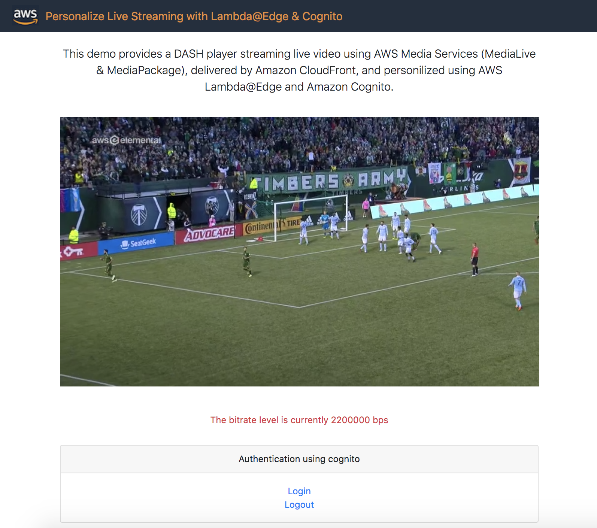
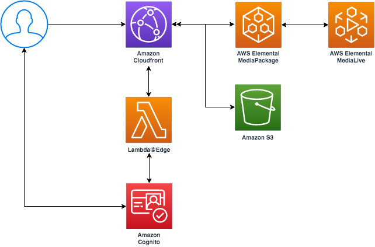

# Personalize Live Streaming with Lambda@Edge & Cognito

This project demos DASH live streaming using AWS Media Services (MediaLive & MediaPackage), delivered by Amazon CloudFront, and personalized using AWS Lambda@Edge and Amazon Cognito. 

# Use case

Only authenticated users can stream live content, otherwise they will get unauthorized-video. Based on the entitlement of the user, he/she will get higher or lower streaming quality (bitrates).



You can try the deployed solution here: https://d2g15edr113hw7.cloudfront.net/console/index.html

premium user  : alice.cloudfront.ibc.2019@gmail.com pass: CloudFront0!

standard user : bob.cloudfront.ibc.2019@gmail.com   pass: CloudFront0!

# Architecture



# Instructions for deploying in us-east-1

## Run the following commands
```
npm install

npm run build

sam build 

sam package --output-template-file packaged.yaml --s3-bucket <YOUR BUCKET NAME> --region us-east-1
  
sam deploy --template-file packaged.yaml --stack-name <YOUR STACK NAME> --capabilities CAPABILITY_IAM --region us-east-1
```
## Create users

Then, go to the created cognito user pool and add a user gourp called premium, then create two users, with one of them in the premium group.


# Future development
- Sign chunks as well
- Fetch raw manifest through CloudFront isntead of MediaPackage directly in Lambda@Edge
- Add CORS headers
- Display Manifest URL on the main page
- Use the Autopublish property for Lambda@Edge function in the CloudFormation template
- Clean code from unused libraries/functionalities (CloudFormation parameters, different streaming formats, HTML...)
- Enable Autoplay
- Store website static assets in the repository instead of an S3 bucket

# Future development

This demo is built based on the following previous projects:
- Authorization@Edge using cookies, Protect your Amazon CloudFront content from being downloaded by unauthenticated users: https://aws.amazon.com/blogs/networking-and-content-delivery/authorizationedge-using-cookies-protect-your-amazon-cloudfront-content-from-being-downloaded-by-unauthenticated-users/
- Live Streaming on AWS: https://aws.amazon.com/solutions/live-streaming-on-aws/
